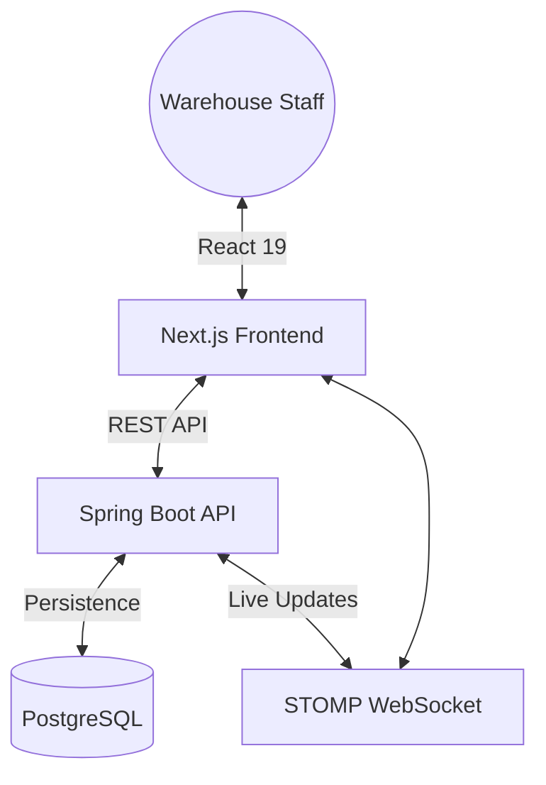

# 📦 Logistics Ledger: Premium Warehouse Management

A high-performance, full-stack monorepo for modern warehouse operations. Featuring real-time inventory tracking, intelligent pick assignment, and operational telemetrics.

---

## 🏗 System Architecture



### Tech Stack
- **Frontend**: Next.js 16 (App Router), Tailwind CSS 4, Lucide Icons
- **Backend**: Spring Boot 3.4.6 (Java 17), Spring Security, JPA/Hibernate
- **Database**: PostgreSQL 16
- **Real-time**: WebSocket + STOMP Broker

---

## 📂 Project Structure

- `api/`: Spring Boot core services and REST endpoints.
- `web/`: Next.js frontend application with premium aesthetics.
- `docs/`: Supplemental documentation including the [User Guide](file:///c:/Proj/Warehouse-Management/docs/UserGuide.md).

---

## 🚀 Quick Start

### 1. Prerequisites
- Docker & Docker Compose
- Node.js 18+
- Java 17+

### 2. Launch Infrastructure (Docker)

**Local Development (DB only or full stack):**
```bash
docker compose -f docker-compose.local.yml up -d
```

**Server Development (Full stack with standard creds):**
```bash
docker compose -f docker-compose.dev.yml up -d
```

**Production (Optimized):**
```bash
docker compose up -d
```

### 3. Start Development Servers
**Backend:**
```bash
cd api
./mvnw spring-boot:run
```

**Frontend:**
```bash
cd web
npm install && npm run dev
```

Visit `http://localhost:3000` to access the interface.

---

## 🛠 Environment Profiles

The system supports three primary profiles to cater to different development and deployment stages:

| Profile | Target | Description | Web Port | API Port |
| :--- | :--- | :--- | :--- | :--- |
| **local** | Local machine | Best for quick local dev. | 3000 | 8080 |
| **dev** | Server (Dev) | Docker dev with Swagger. | 3050 | 5050 |
| **prod** | Server (Prod) | Hardened for production. | 3051 | 5051 |

### Configuration via `.env`
Shared variables are managed in the root `.env` file. You can override these for different server environments:
- `SPRING_PROFILES_ACTIVE`: Set to `local`, `dev`, or `prod`.
- `API_PORT`, `WEB_PORT`: Custom port mappings.
- `DB_URL`, `DB_USERNAME`, `DB_PASSWORD`: Target database coordinates.
- `JWT_SECRET`: Critical security key for production.

**Docker Commands:**

**Local Development (3000/8080):**
```bash
docker compose -f docker-compose.local.yml up -d
```

**Server Development (3050/5050):**
```bash
docker compose -f docker-compose.dev.yml up -d
```

**Production (3051/5051):**
```bash
docker compose -f docker-compose.prod.yml up -d
# OR simply:
docker compose up -d
```

---

## 🔒 Security & Roles
The system implements Role-Based Access Control (RBAC):
- **ADMIN**: Full system override and management.
- **WAREHOUSE_MANAGER**: Inventory and staff orchestration.
- **STAFF**: Locked to assigned warehouse nodes for secure picking/moving.

---

## 📡 Real-time Telemetrics
Autonomous stock movements and task updates are broadcasted via STOMP over WebSockets for a zero-latency experience across all connected clients.

---

## 🛠 Maintenance
- **Linting**: `npm run lint` (frontend)
- **Testing**: `./mvnw test` (backend)

---

Developed by **Sumukha KY**
